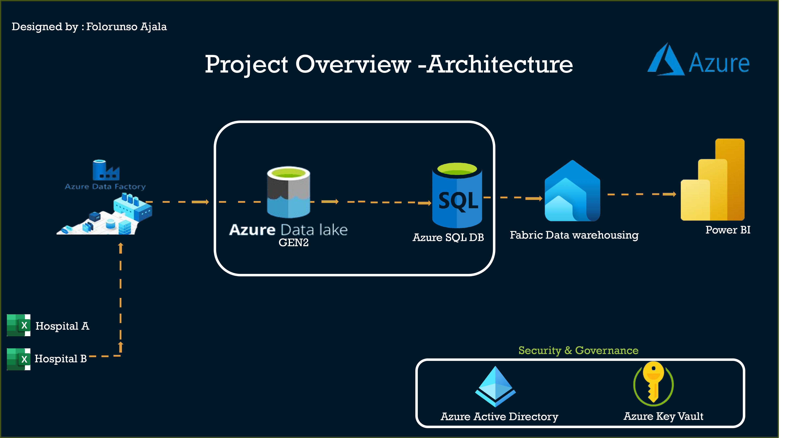
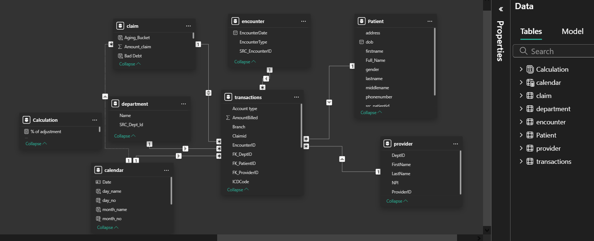
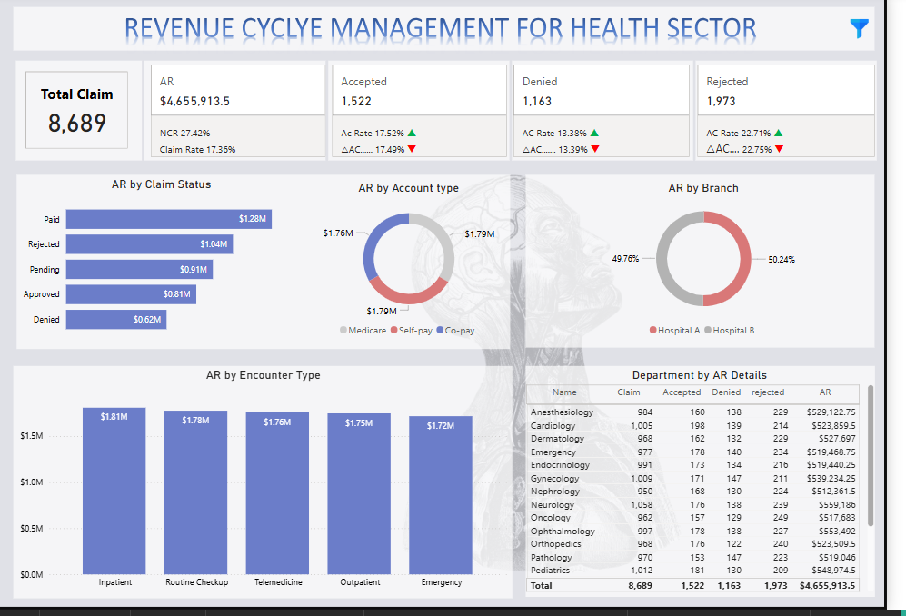

# Revenue Cycle Management (RCM) & Accounts Receivable (AR) Analysis

## Introduction

The healthcare industry faces a growing challenge in managing Revenue Cycle Management (RCM) and Accounts Receivable (AR). Efficient cash flow and reimbursement from payers are critical to sustaining high-quality patient care. However, delays in claim processing, denials, and outstanding balances pose risks to the financial stability of hospitals. This document explores an end-to-end data-driven approach to analyzing RCM and AR challenges, utilizing Microsoft Azure,Fabric & Power BI for insights and optimization.

## Problem Statement

The hospital’s financial team observed a declining Net Collection Rate (NCR) and a significant increase in aging AR, particularly claims older than 90 days. The primary concerns included:
-	High claim rejections and denials, leading to lost revenue.
-	Excessive outstanding patient balances, particularly in self-pay accounts.
-	Growing bad debt, with over 25% of billed revenue going uncollected.
-	Delayed collections from key payers such as Medicare and Aetna.
-	Poor visibility into departmental billing performance, impacting financial planning.

## Skills Demonstrated, this project showcases expertise in:
- Data Analytics & Visualization (Power BI, SQL, Excel & Fabric)
- Financial Modeling & KPI Development
- ETL & Data Transformation using Azure Data Factory (ADF) and Azure SQL Database
- Revenue Cycle Optimization
- Business Intelligence Reporting

## Data Sourcing
The analysis is based on structured datasets extracted from hospital financial systems, covering:
- Transaction Data (billing, payments, claim status)
- Patient Information (demographics, payment responsibility)
- Encounter Records (inpatient, outpatient, telemedicine, emergency visits)
- Claims Data (approved, denied, rejected claims, payers)

## Data Transformation
To ensure a clean dataset for analysis, the following data processing steps were applied using Azure Data Factory (ADF) for ingestion and Azure SQL Database for transformation:
-	Data Cleaning: Removed duplicate records, fixed inconsistencies in claim statuses.
-	Standardization: Unified payer names, claim categories, and encounter types.
-	Time-Based Metrics: Calculated Charge Lag, Days in AR, and Aging Buckets (0-30, 31-60, 61-90, 90+ days).
-	KPI Calculation: Formulated Net Collection Rate (NCR), Bad Debt Rate, Claim Denial Rate, and First Pass Resolution Rate (FPRR).

 ## Modeling

 The data model was structured using Power BI, connecting various relational tables stored in Azure SQL Database:
-	Fact Table: Transactions  
-	Dimension Tables: Patients, Providers, Departments , Encounter & Claims

###	Relationships:
-	Transactions linked to Claims and Patients
-	Transactions linked to Departments & Providers
-	Transactions linked to Calendar and Encounter 

## Analysis & Visualization

A series of interactive Power BI dashboards were created to visualize the findings:
1. **Financial Performance Overview**
-	Net Collection Rate (27.38%) → Far below industry standard (80-90%), indicating poor revenue recovery.
-	Bad Debt Rate (25.28%) → Suggests significant write-offs due to non-payments.
2. **AR Aging Analysis**
-	$3.25M (69.8%) of AR is >90 days old → Poses a serious risk of non-collection.
-	Only $0.3M (6.4%) is in the 0-30 days bucket → Indicates slow payment processing.
3. **Claim Status Performance**
-	Rejected Claims ($1.04M) & Denied Claims ($0.62M) → Over $1.66M in unprocessed revenue.
-	Key Issues: Incorrect coding, missing documentation, late submissions.
4. **AR by Account Type**
-	Self-pay patients contribute 50.09% of AR → High risk of non-payment due to financial constraints.
-	Medicare & Aetna owe $1.79M and $1.02M, respectively → Need for aggressive follow-up.
5. **AR by Department**
-	_Neurology_ , _Surgery_ , and _Gynecology_  have the highest AR balances.
-	_Dermatology_ has the highest rejection rate, signaling documentation or coding issues.

click [here](https://app.powerbi.com/view?r=eyJrIjoiNDMxZGVkZjMtOTY0OS00YjUyLTk3ZWQtMDVjYjdhN2YzOTBmIiwidCI6IjQzOGFiNWNlLTljODEtNDI0Ni05Yjk4LTI5ZmY3YWQ3ZDBhOSJ9) to interact with the  Power BI Report 

## Conclusion & Recommendations
---
**Key Findings**:
-	Aging AR is dangerously high (>90 days: $3.25M) → Requires immediate intervention.
-	Net Collection Rate (27.38%) is suboptimal → Indicating gaps in claim processing and follow-ups.
-	Claim rejections & denials account for significant lost revenue ($1.66M).
-	Bad debt levels (25.28%) are unacceptable → Patients are struggling to pay outstanding balances.

## Action Plan for Improvement:
1️⃣ **Reduce Aging AR**:
-	Assign dedicated teams to follow up on claims older than 60 days.
-	Implement automated reminders for patient payments.
-	Negotiate faster payment terms with insurance providers.
---

2️⃣**Optimize Claim Submissions**:
-	Implement pre-claims verification to catch errors before submission.
-	Automate claim tracking and resubmit rejections quickly.
---

3️⃣ **Enhance Patient Collections**:
-	Offer flexible payment plans and financing options for self-pay balances.
-	Increase patient engagement through early billing notifications.
---

4️⃣ Departmental & Payer Focus:
-	Work with Neurology, Surgery, and Gynecology to optimize claim processing.
-	Strengthen relationships with Medicare & Aetna for faster settlements.
---

5️⃣ **Technology & Automation**:
-	Use AI-based predictive analytics to flag potential claim denials.
-	Implement automated AR tracking dashboards for real-time visibility.

By following this structured approach, the hospital can significantly improve cash flow, reduce bad debt, enhance payer relations, and optimize financial sustainability.
Let’s collaborate to drive better RCM efficiency and save our hospital from collapsing! 🚀

