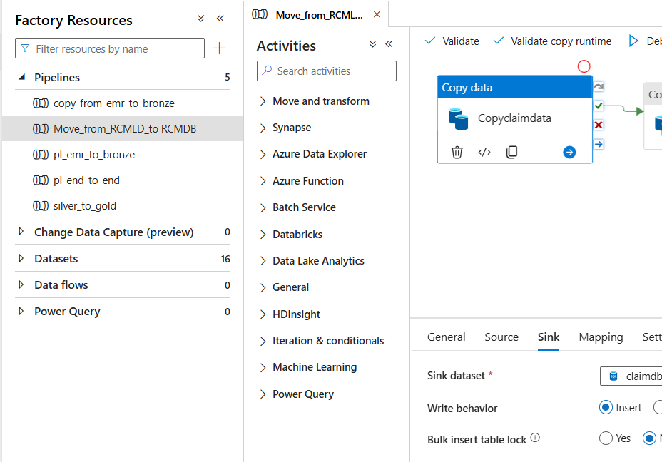

# Revenue Cycle Management (RCM) & Accounts Receivable (AR) Analysis

## Introduction

The healthcare industry faces a growing challenge in managing Revenue Cycle Management (RCM) and Accounts Receivable (AR). Efficient cash flow and reimbursement from payers are critical to sustaining high-quality patient care. However, delays in claim processing, denials, and outstanding balances pose risks to the financial stability of hospitals. This document explores an end-to-end data-driven approach to analyzing RCM and AR challenges, utilizing Microsoft Azure,Fabric & Power BI for insights and optimization.

## Problem Statement

The hospital’s financial team observed a declining Net Collection Rate (NCR) and a significant increase in aging AR, particularly claims older than 90 days. The primary concerns included:
•	High claim rejections and denials, leading to lost revenue.
•	Excessive outstanding patient balances, particularly in self-pay accounts.
•	Growing bad debt, with over 25% of billed revenue going uncollected.
•	Delayed collections from key payers such as Medicare and Aetna.
•	Poor visibility into departmental billing performance, impacting financial planning.

## Skills Demonstrated, this project showcases expertise in:
- Data Analytics & Visualization (Power BI, SQL, Excel & Fabric)
- Financial Modeling & KPI Development
- ETL & Data Transformation using Azure Data Factory (ADF) and Azure SQL Database
- Revenue Cycle Optimization
- Business Intelligence Reporting

## Data Sourcing
The analysis is based on structured datasets extracted from hospital financial systems, covering:
- Transaction Data (billing, payments, claim status)
- Patient Information (demographics, payment responsibility)
- Encounter Records (inpatient, outpatient, telemedicine, emergency visits)
- Claims Data (approved, denied, rejected claims, payers)

## Data Transformation
To ensure a clean dataset for analysis, the following data processing steps were applied using Azure Data Factory (ADF) for ingestion and Azure SQL Database for transformation:
-	Data Cleaning: Removed duplicate records, fixed inconsistencies in claim statuses.
-	Standardization: Unified payer names, claim categories, and encounter types.
-	Time-Based Metrics: Calculated Charge Lag, Days in AR, and Aging Buckets (0-30, 31-60, 61-90, 90+ days).
-	KPI Calculation: Formulated Net Collection Rate (NCR), Bad Debt Rate, Claim Denial Rate, and First Pass Resolution Rate (FPRR).

